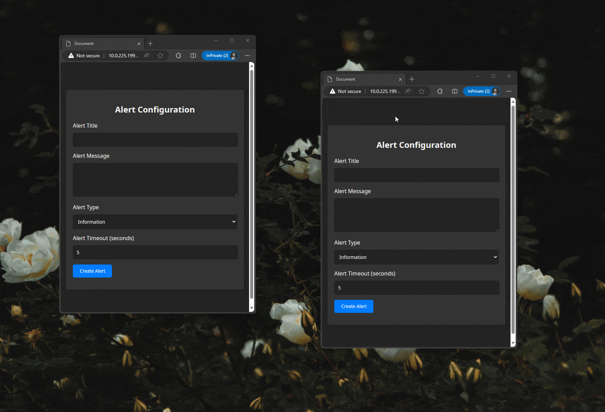

# Broadcast Channel API Demo

<!-- ### [Demo Available](https://danlegt.com/projects) -->

This is a small project that demonstrates how the browser's **Broadcast Channel API** works. The Broadcast Channel API allows you to communicate between different tabs or windows of a single browser, making it easy to send messages or data between them.

In this demo, we have created a simple example of sending alerts from one tab/window to all the other open instances of the same web page. This can be useful for scenarios where you want to notify users across different tabs or windows of your web application about important events or updates.

## Table of Contents

*   [How It Works](#how-it-works)
*   [Getting Started](#getting-started)
*   [Example Usage](#example-usage)
*   [The why](#the-why)
*   [Resources](#resources)

## How It Works

The Broadcast Channel API works by creating a communication channel that can be accessed by multiple tabs or windows of the same origin (i.e., the same website). It allows you to broadcast messages to all connected channels.

In this demo, we create a Broadcast Channel named "alerts" in TypeScript, and then we can send messages to that channel. All open tabs/windows on the same website that have subscribed to the "alerts" channel will receive and display the messages as alerts.



## Getting Started

To run this demo locally, follow these steps:

```bash
# 1.  Clone this repository to your local machine:
git clone https://github.com/JustKato/broadcast-channel-demo

# 2.  Navigate to the project directory:
cd broadcast-channel-demo

# 3.  Run the install command
npm install

# 4. You can either use the start command or build the project
npm run build # To build the project
npm start # Run the project on localhost:1234
```

## Example Usage

In the provided code, we create a Broadcast Channel named "alerts":

```ts
const channel = listeningChannel = new BroadcastChannel('alerts');
```

To send an alert message to all open instances, you can use the following code:
```ts
channel.postMessage('New alert message!');
```

All open tabs or windows of the same website that have subscribed to the "alerts" channel will display an alert with the message "New alert message!" when this code is executed.

You can customize the message and use this mechanism to broadcast various types of notifications or updates across different tabs or windows of your web application.

I have utilized a method I use for all [MessageEvent](https://developer.mozilla.org/en-US/docs/Web/API/MessageEvent) based APIs ( WebSockets, Server Sent Events, Channel Messaging, Cross-Worker/Docuemnt Messaging, etc... ) by wrapping all my events into an encapsulator which generifies the handling of messages making sure I respect the same format and won't get JSON parse errors.

## The why

The Broadcast Channel API offers a variety of real-world applications, especially in enhancing user experience and improving efficiency within single-user, multi-tab environments. Here are some practical examples:

1. **Synchronized Notifications Across Tabs**: Similar to your example, businesses can use the API to synchronize notifications across all open browser tabs. This is particularly useful for ensuring that a user receives an important alert or message, regardless of which tab they are currently viewing.

2. **Real-Time Data Updates on Multiple Tabs**: For web applications like stock trading platforms such as Binance, Coinbase, news sites, or any live data feed, the API can ensure that all open tabs display the most current data without needing to refresh each tab individually.

3. **User Session Management**: Web Applications can use the Broadcast Channel API to manage user sessions. For instance, if a user logs out or times out in one tab, all other tabs can be updated to reflect this change, enhancing security and user experience.

4. **Customer Support and Chat Applications**: In customer support or chat applications, the Broadcast Channel API can ensure that messages or support tickets are updated in real-time across all tabs, so that a user doesn't miss any important communication. This is one of the best usages I could think of, it's extremely annoying not having the chat across multiple tabs.

5. **Task Management and To-Do Lists**: For task management or to-do list applications, the API can synchronize updates like task completion or new task addition across all tabs, keeping the user's list updated irrespective of the tab they are viewing.

## Resources

*   [MDN Web Docs - Broadcast Channel API](https://developer.mozilla.org/en-US/docs/Web/API/Broadcast_Channel_API): Learn more about the Broadcast Channel API.
*   [HTML Living Standard - BroadcastChannel](https://html.spec.whatwg.org/multipage/web-messaging.html#broadcastchannel): Check the HTML Living Standard for the full specification of the BroadcastChannel interface.
*   [Can I use Broadcast Channel API?](https://caniuse.com/?search=Broadcast%20Channel): Check the browser compatibility for the Broadcast Channel API.